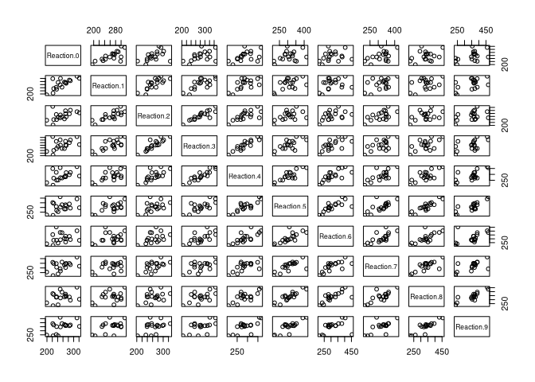

Presentation of the case study
------------------------------

We are analysing the effect of sleep deprivation on reaction time of
long distance truck drivers. There are 18 subjects in the dataset and
for each subject, the reaction time was measured for 10 days. The
subjects were allowed only a limited amount of sleep for these 10
subsequent days. Each subject’s reaction time was measured several times
on each day of the trial and an average was taken.

Reaction time is measured with a psychomotor vigilance task (PVT), which
measures the speed with which subjects respond to a visual stimulus.

Is there any relation between reaction time and the number of days of
sleep deprivation?

Exploratory analysis
--------------------

    ##    Reaction Days Subject
    ## 1  249.5600    0     308
    ## 2  258.7047    1     308
    ## 3  250.8006    2     308
    ## 4  321.4398    3     308
    ## 5  356.8519    4     308
    ## 6  414.6901    5     308
    ## 7  382.2038    6     308
    ## 8  290.1486    7     308
    ## 9  430.5853    8     308
    ## 10 466.3535    9     308
    ## 11 222.7339    0     309
    ## 12 205.2658    1     309

This dataset contains multiple measurements for each subject on
consecutive days, with as response variable the continuous variable
reaction time and explanatory variable Days. Since there are 10
measurements for each subject, it is a longitudinal study. The dataset
of 18 subjects is balanced with an equal amount of measurements for each
subject.

### Spaghetti Plot

To visualise the individual reaction times and how they compare to the
mean, a spaghetti plot was created. This revealed that there was a
variation in intercepts or starting reaction times on day 0 between
subjects. This variation increased with subsequent days.

For most subjects, the reaction time increased with the amount of days
of sleep deprivation. This increase is also visible in the mean.

Boxplot
-------

The following boxplot was created to get a quick summary of the
dataset’s characteristics. The mean and median seem to show a similar
increase throughout the study. For day nr 6, 7 and 10, outliers are
observed.  
The variance increases with an increase in days of sleep deprivation but
the interquartile range appears to expand not as strongly as the minimum
and maximum of the boxplot.

To put together, some subjects deviate more from the mean with an
increase in days of sleep deprivation (see outliers on both sides) while
most others stay around the mean (see slower increase in interquartile
range).

The violin plot supports the above observations of the distribution of
the data around the mean with outliers.

Summary
-------

|       |     Days|       Mean|        SD|       Var|                                                                                                                                                                                                      n|
|-------|--------:|----------:|---------:|---------:|------------------------------------------------------------------------------------------------------------------------------------------------------------------------------------------------------:|
| 0     |        0|     256.65|     32.13|   1032.30|                                                                                                                                                                                                     18|
| 1     |        1|     264.50|     33.43|   1117.59|                                                                                                                                                                                                     18|
| 2     |        2|     265.36|     29.47|    868.68|                                                                                                                                                                                                     18|
| 3     |        3|     282.99|     38.86|   1509.92|                                                                                                                                                                                                     18|
| 4     |        4|     288.65|     42.54|   1809.47|                                                                                                                                                                                                     18|
| 5     |        5|     308.52|     51.77|   2680.09|                                                                                                                                                                                                     18|
| 6     |        6|     312.18|     63.17|   3990.92|                                                                                                                                                                                                     18|
| 7     |        7|     318.75|     50.10|   2510.41|                                                                                                                                                                                                     18|
| 8     |        8|     336.63|     60.20|   3624.01|                                                                                                                                                                                                     18|
| 9     |        9|     350.85|     66.99|   4487.15|                                                                                                                                                                                                     18|
| The c |  alculat|  ions of t|  he mean,|  standard|  deviation and variance of the reaction time for each day of all subjects, further support our exploratory plots: we observe an increase in the mean and variance with more days of sleep deprivation.|

Mean evolution
--------------

To further support our previous findings, we looked at the mean
evolution. Here, an increasing trend of reaction time with increasing
number of days is also observed, together with expanding standard
deviations (see errorbars).

Correlation
-----------

|     |  Subject|  Reaction.0|  Reaction.1|  Reaction.2|  Reaction.3|  Reaction.4|  Reaction.5|  Reaction.6|  Reaction.7|  Reaction.8|  Reaction.9|
|-----|--------:|-----------:|-----------:|-----------:|-----------:|-----------:|-----------:|-----------:|-----------:|-----------:|-----------:|
| 1   |      308|    249.5600|    258.7047|    250.8006|    321.4398|    356.8519|    414.6901|    382.2038|    290.1486|    430.5853|    466.3535|
| 11  |      309|    222.7339|    205.2658|    202.9778|    204.7070|    207.7161|    215.9618|    213.6303|    217.7272|    224.2957|    237.3142|
| 21  |      310|    199.0539|    194.3322|    234.3200|    232.8416|    229.3074|    220.4579|    235.4208|    255.7511|    261.0125|    247.5153|
| 31  |      330|    321.5426|    300.4002|    283.8565|    285.1330|    285.7973|    297.5855|    280.2396|    318.2613|    305.3495|    354.0487|
| 41  |      331|    287.6079|    285.0000|    301.8206|    320.1153|    316.2773|    293.3187|    290.0750|    334.8177|    293.7469|    371.5811|
| 51  |      332|    234.8606|    242.8118|    272.9613|    309.7688|    317.4629|    309.9976|    454.1619|    346.8311|    330.3003|    253.8644|
| 61  |      333|    283.8424|    289.5550|    276.7693|    299.8097|    297.1710|    338.1665|    332.0265|    348.8399|    333.3600|    362.0428|
| 71  |      334|    265.4731|    276.2012|    243.3647|    254.6723|    279.0244|    284.1912|    305.5248|    331.5229|    335.7469|    377.2990|
| 81  |      335|    241.6083|    273.9472|    254.4907|    270.8021|    251.4519|    254.6362|    245.4523|    235.3110|    235.7541|    237.2466|
| 91  |      337|    312.3666|    313.8058|    291.6112|    346.1222|    365.7324|    391.8385|    404.2601|    416.6923|    455.8643|    458.9167|
| 101 |      349|    236.1032|    230.3167|    238.9256|    254.9220|    250.7103|    269.7744|    281.5648|    308.1020|    336.2806|    351.6451|
| 111 |      350|    256.2968|    243.4543|    256.2046|    255.5271|    268.9165|    329.7247|    379.4445|    362.9184|    394.4872|    389.0527|
| 121 |      351|    250.5265|    300.0576|    269.8939|    280.5891|    271.8274|    304.6336|    287.7466|    266.5955|    321.5418|    347.5655|
| 131 |      352|    221.6771|    298.1939|    326.8785|    346.8555|    348.7402|    352.8287|    354.4266|    360.4326|    375.6406|    388.5417|
| 141 |      369|    271.9235|    268.4369|    257.2424|    277.6566|    314.8222|    317.2135|    298.1353|    348.1229|    340.2800|    366.5131|
| 151 |      370|    225.2640|    234.5235|    238.9008|    240.4730|    267.5373|    344.1937|    281.1481|    347.5855|    365.1630|    372.2288|
| 161 |      371|    269.8804|    272.4428|    277.8989|    281.7895|    279.1705|    284.5120|    259.2658|    304.6306|    350.7807|    369.4692|
| 171 |      372|    269.4117|    273.4740|    297.5968|    310.6316|    287.1726|    329.6076|    334.4818|    343.2199|    369.1417|    364.1236|

    ## 
    ##  Shapiro-Wilk normality test
    ## 
    ## data:  sleep.resh[, i]
    ## W = 0.97667, p-value = 0.9093
    ## 
    ## 
    ##  Shapiro-Wilk normality test
    ## 
    ## data:  sleep.resh[, i]
    ## W = 0.94756, p-value = 0.388
    ## 
    ## 
    ##  Shapiro-Wilk normality test
    ## 
    ## data:  sleep.resh[, i]
    ## W = 0.98688, p-value = 0.9936
    ## 
    ## 
    ##  Shapiro-Wilk normality test
    ## 
    ## data:  sleep.resh[, i]
    ## W = 0.97738, p-value = 0.919
    ## 
    ## 
    ##  Shapiro-Wilk normality test
    ## 
    ## data:  sleep.resh[, i]
    ## W = 0.97247, p-value = 0.8427
    ## 
    ## 
    ##  Shapiro-Wilk normality test
    ## 
    ## data:  sleep.resh[, i]
    ## W = 0.978, p-value = 0.9271
    ## 
    ## 
    ##  Shapiro-Wilk normality test
    ## 
    ## data:  sleep.resh[, i]
    ## W = 0.95912, p-value = 0.5847
    ## 
    ## 
    ##  Shapiro-Wilk normality test
    ## 
    ## data:  sleep.resh[, i]
    ## W = 0.94648, p-value = 0.3724
    ## 
    ## 
    ##  Shapiro-Wilk normality test
    ## 
    ## data:  sleep.resh[, i]
    ## W = 0.97112, p-value = 0.8186
    ## 
    ## 
    ##  Shapiro-Wilk normality test
    ## 
    ## data:  sleep.resh[, i]
    ## W = 0.86251, p-value = 0.01342

    ##            Reaction.0 Reaction.1 Reaction.2 Reaction.3 Reaction.4 Reaction.5
    ## Reaction.0  1.0000000  0.6594427  0.5686275  0.4179567  0.4571723  0.2239422
    ## Reaction.1  0.6594427  1.0000000  0.7461300  0.6367389  0.5562436  0.3581011
    ## Reaction.2  0.5686275  0.7461300  1.0000000  0.8534572  0.7234262  0.4344685
    ## Reaction.3  0.4179567  0.6367389  0.8534572  1.0000000  0.9133127  0.6553148
    ## Reaction.4  0.4571723  0.5562436  0.7234262  0.9133127  1.0000000  0.7296182
    ## Reaction.5  0.2239422  0.3581011  0.4344685  0.6553148  0.7296182  1.0000000
    ## Reaction.6  0.2218782  0.2920537  0.4551084  0.6759546  0.7812178  0.7667699
    ## Reaction.7  0.3457172  0.3312693  0.5087719  0.4509804  0.5789474  0.7254902
    ## Reaction.8  0.1640867  0.1496388  0.2899897  0.4654283  0.5376677  0.8121775
    ## Reaction.9  0.3106295  0.2899897  0.3168215  0.4633643  0.5933953  0.7378741
    ##            Reaction.6 Reaction.7 Reaction.8 Reaction.9
    ## Reaction.0  0.2218782  0.3457172  0.1640867  0.3106295
    ## Reaction.1  0.2920537  0.3312693  0.1496388  0.2899897
    ## Reaction.2  0.4551084  0.5087719  0.2899897  0.3168215
    ## Reaction.3  0.6759546  0.4509804  0.4654283  0.4633643
    ## Reaction.4  0.7812178  0.5789474  0.5376677  0.5933953
    ## Reaction.5  0.7667699  0.7254902  0.8121775  0.7378741
    ## Reaction.6  1.0000000  0.7110423  0.6904025  0.6181631
    ## Reaction.7  0.7110423  1.0000000  0.6573787  0.6243550
    ## Reaction.8  0.6904025  0.6573787  1.0000000  0.8452012
    ## Reaction.9  0.6181631  0.6243550  0.8452012  1.0000000

We used the Shapiro-Wilk test to check for normality of the reaction
times per day.

The test revealed a non normal distribution of day 9. Thus, we performed
the spearman correlation method instead of pearson to check for a
correlation of the reaction times between days.

Looking at the correlation matrix, there is a correlation higher then
0.6 between subsequent days (e.g. between Day 8 and 9, between Day 3 and
4, …). However, the further the days are apart, the lower the
correlation (e.g. low correlation between Day 1 and Day 8).

Aligning nicely with our previous results, there is a linear trend
between the number of Days and reaction time.

Regression per person
---------------------

We performed a linear regression model on each subject based on the
function: reaction time = b0 + bi\* Days.

We then created a trellis graph to visualise the intercepts and slopes
of these subject-specific linear regression models.

The graph suggests that the slope and intercept of each subject’s linear
model are independent of each other as there is no observable trend
between the height of the intercept and the steepness of the slope. This
is further supported by plotting the intercept against the slope.
Overall, all subjects have a positive slope besides subject 335.

The linear regression lines fit the datapoints closely, suggesting that
a linear model is appropriate to represent this dataset.

Between subject variability
---------------------------

The individual intercepts shown in the first histogram correspond to the
initial reaction time and are non normally distributed. Given the small
data set, this is not surprising as it shows a variety of their initial
reaction time. However, if this data came from a large dataset, it would
be surprising that even the initial data points are not normally
distributed and could suggest a wrong data sample compared to the
population.

Looking at the histogram of individual slopes, we see a normal
distribution. As seen on the previous graph showcasing the individual
linear regressions, very little slopes are negative. This shows again
that reaction time increases by days of sleep deprivation.

Finally, looking at the histogram of R squared, we see that the majority
of subjects have a R squared of above 0.6. This shows that the linear
model is appropriate for this data set. However, sometimes the
individual linear model does not fit the specific data of some subjects,
specifically 7 of the 18 subjects.

Fitting the model - with REML
-----------------------------

    ## Linear mixed model fit by REML ['lmerMod']
    ## Formula: Reaction ~ 1 + Days + (1 + Days | Subject)
    ##    Data: sleep
    ## 
    ## REML criterion at convergence: 1743.6
    ## 
    ## Scaled residuals: 
    ##     Min      1Q  Median      3Q     Max 
    ## -3.9536 -0.4634  0.0231  0.4633  5.1793 
    ## 
    ## Random effects:
    ##  Groups   Name        Variance Std.Dev. Corr
    ##  Subject  (Intercept) 611.90   24.737       
    ##           Days         35.08    5.923   0.07
    ##  Residual             654.94   25.592       
    ## Number of obs: 180, groups:  Subject, 18
    ## 
    ## Fixed effects:
    ##             Estimate Std. Error t value
    ## (Intercept)  251.405      6.824  36.843
    ## Days          10.467      1.546   6.771
    ## 
    ## Correlation of Fixed Effects:
    ##      (Intr)
    ## Days -0.138

Values
------

$$\\begin{align}
\\gamma\_{0}  &= 251.405 \\\\
\\gamma\_{1}  &= 10.467  \\\\
\\\\
\\sigma\_{\\epsilon}^{2} &= 654.94 \\\\
\\sigma\_{0}^{2} &= 611.90 \\\\
\\sigma\_{1}^{2} &= 35.08 \\\\
corr(b\_{0i}, b\_{1i}) &= 0.07
\\end{align}$$

\#\#Mathematical description

Level 1 model explains the evolution of Reaction time for each subject
*Y**i**j*= *π*0*i* + *π*1*i*\*
*D**a**y**s**i**j* -\> how do individuals evolve +
*ϵ**i**j* -\> how the individuals deviate from their own
evolution

$$\\begin{align}
Y\_{ij}&= \\pi\_{0i} + \\pi\_{1i}\* \\text{Days}\_{ij} && \\text{how do individuals evolve} \\\\
          &+ \\epsilon\_{ij} &&\\text{how the individuals deviate from their own evolution}
\\end{align}$$

Level 2 model tries to explain why the Subjects differ from each other
*π*0*i* = *γ*0 + *b*0*i* - model for
explaining the intercept *π*1*i* = *γ*1 +
*b*1*i* - model for explaining the slope

$$\\begin{align}
π\_{0i} &= γ\_{0} + b\_{0i} &&\\text{model for explaining the intercept} \\\\
π\_{1i} &= γ\_{1} + b\_{1i} &&\\text{model for explaining the slope}
\\end{align}$$

*σ*02 - Level 2 residual variance in true
intercept *π*0*i* across all individuals in the population
*σ*12 - Level 2 residual variance in true slope
*π*1*i* across all individuals in the population

With level 2 model we are trying to see why there is variation between
individuals by looking at the intercept and at the slope.
*b*0*i* and *b*1*i* are the unexplained
variability

The full model describes the evolution observed in spaghetti plot:
*Y**i**j* = *γ*0 + *b*0*i* +
*γ*1\* *D**a**y**s**i**j* - fixed effects +
*b*0*i* + *b*1*i*\**D**a**y**s**i**j* -
random effects + *ϵ**i**j* - error

$$\\begin{align}
Y\_{ij} =& γ\_{0} + b\_{0i} + γ\_{1}\* \\text{Days}\_{ij} &&\\text{fixed effects}\\\\
          &+ b\_{0i} + b\_{1i}\*\\text{Days}\_{ij} &&\\text{random effect}\\\\
          &+ \\epsilon\_{ij} &&\\text{error}
\\end{align}$$

$$
\\begin{cases}
Y\_{ij}&= π\_{0i} + π\_{1i}\* \\text{Days}\_{ij} + ε\_{ij} \\\\
π\_{0i} &= γ\_{0} + b\_{0i} &&\\text{intercept} \\\\
\<!-- π\_{1i} &= γ\_{1} + b\_{1i} &&\\text{slope} --\>
\\end{cases}
$$

Following is the average evolution of the population:
E(*Y**i**j*) = *γ*0 + *γ*1\*
*D**a**y**s**i**j*

The general liniar mixed model is given by:

*Y**i* = *X**i**β* +
*Z**i**b**i* + *ϵ**i* *b**i*
\~ N(0,D) , *ϵ**i* \~ N(0,*Σ**i*)
*b*1..., *b**N*,*ϵ*1..., *ϵ**N*
independent

$$Y\_i \\tilde{} N(X\_i\\beta, Z\_iDZ\_i'+\\Sigma\_i)$$
\#\#\#todo:write the model with values given by R

$$\\begin{align}
Y\_i = X\_i\\beta + Z\_i b\_i + ε\_i \\\\ 
b\_i \\sim N(0,D)\\text{, }ε\_i \\sim N(0,Σ\_i) \\\\ 
b\_1\\cdots,b\_N, ε\_1\\cdots,ε\_N \\text{independent}
\\end{align}$$

R uses the marginal model and our calcuation are based on that. Next
step is to check if the values we retrieved are actually significant so
does the number of days have a significant effect on the reaction time?
We tested this with Bootstrap and Likelihood Ratio tests because th
sample zise wasn’t large enough(excluding Wald test).

Testing fixed effects - with bootstrap
--------------------------------------

    ## Computing bootstrap confidence intervals ...

    ## 
    ## 6 message(s): boundary (singular) fit: see ?isSingular
    ## 177 warning(s): Model failed to converge with max|grad| = 0.00200018 (tol = 0.002, component 1) (and others)

    ##                                    2.5 %      97.5 %
    ## sd_(Intercept)|Subject        12.8354673  36.0104706
    ## cor_Days.(Intercept)|Subject  -0.4944365   0.9914119
    ## sd_Days|Subject                3.2926153   8.2801698
    ## sigma                         22.5444053  28.6615536
    ## (Intercept)                  237.0037532 264.8425157
    ## Days                           7.1240599  13.5908568

Confidence interval of the intercept and days does not include 0
therefore both of them have a significant effect on reaction time.

likelihood ratio test with anova
--------------------------------

    ## Data: sleep
    ## Models:
    ## sleep.intercept: Reaction ~ 1 + (1 | Subject)
    ## sleep.full: Reaction ~ 1 + Days + (1 + Days | Subject)
    ##                 Df    AIC    BIC  logLik deviance Chisq Chi Df Pr(>Chisq)    
    ## sleep.intercept  3 1916.5 1926.1 -955.27   1910.5                            
    ## sleep.full       6 1763.9 1783.1 -875.97   1751.9 158.6      3  < 2.2e-16 ***
    ## ---
    ## Signif. codes:  0 '***' 0.001 '**' 0.01 '*' 0.05 '.' 0.1 ' ' 1

We compared an intercept only model with a model that includes days as
well and we concluded that adding days as covariate it improves our
model significantly. Days have have a significant effect on the reaction
time with the p-value smaller than 0.05. The decrease in AIC value also
supports this conclusion.

### OLS vs LMM estimates

\#plot random intercept and random slope

    ##             (Intercept)      Days
    ## (Intercept)  611.897607  9.613886
    ## Days           9.613886 35.081069
    ## attr(,"stddev")
    ## (Intercept)        Days 
    ##   24.736564    5.922927 
    ## attr(,"correlation")
    ##             (Intercept)       Days
    ## (Intercept)  1.00000000 0.06561803
    ## Days         0.06561803 1.00000000

$$\\begin{pmatrix}
b\_{0i} \\\\
b\_{1i}
\\end{pmatrix}
\\sim
N\\begin{pmatrix}
\\begin{pmatrix}
0 \\\\
0
\\end{pmatrix},
\\begin{pmatrix}
\\sigma\_{0}^2 & \\sigma\_{01} \\\\
\\sigma\_{01} & \\sigma\_{1}^2 
\\end{pmatrix}
\\end{pmatrix}\\\\
\\begin{pmatrix}
b\_{0i} \\\\
b\_{1i}
\\end{pmatrix}
\\sim
N\\begin{pmatrix}
\\begin{pmatrix}
0 \\\\
0
\\end{pmatrix},
\\begin{pmatrix}
611.9 & 9.61 \\\\
9.61 & 35.08 
\\end{pmatrix}
\\end{pmatrix}
$$
D: Random effects covariance matrix The model is built on the assumption
that the b’s come from a normal distribution with mean 0 and the
residual variance in true intercept *π*0*i* across all
individuals in the population of 611.9, the residual variance in true
slope for all individuals is 35.08 and residual covariance between the
intercept and the slope of 9.61.

    ##     (Intercept)        Days
    ## 308   2.2575329   9.1992737
    ## 309 -40.3942719  -8.6205161
    ## 310 -38.9563542  -5.4495796
    ## 330  23.6888704  -4.8141448
    ## 331  22.2585409  -3.0696766
    ## 332   9.0387625  -0.2720535
    ## 333  16.8389833  -0.2233978
    ## 334  -7.2320462   1.0745075
    ## 335  -0.3326901 -10.7524799
    ## 337  34.8865253   8.6290208

This table preditcs the random effect for each subject.Almost all values
lay within two standard devation from the mean.

    ##     (Intercept)      Days
    ## 308    253.6626 19.666560
    ## 309    211.0108  1.846770
    ## 310    212.4488  5.017706
    ## 330    275.0940  5.653141
    ## 331    273.6636  7.397609
    ## 332    260.4439 10.195232

### to do: compare the two models by creating the mean!

### Discussion ???

From our analysis on the effect of sleep deprivation on the reaction
time of long distance truck drivers, we concluded that there is a
significant positive correlation between them. More precisely, as the
sleep deprivation proceeds, the time needed for a driver to respond to a
visual stimulus is increasing. Several groups of drivers with different
conditions of restricted sleep deprivation or a control group would
additionally help us draw a more concrete conclusion. From the existing
literature, mathematical models predicting alertness from preceding
sleep-wake history typically involve four factors, sleep homeostasis,
circadian rhythm, sleep inertia and neuromodulatory changes. Thus, we
can conclude that there is a relation between reaction time and sleep
deprivation, but it is not the only factor that can fully describe the
relationship of sleep deprivation and the reaction time.
